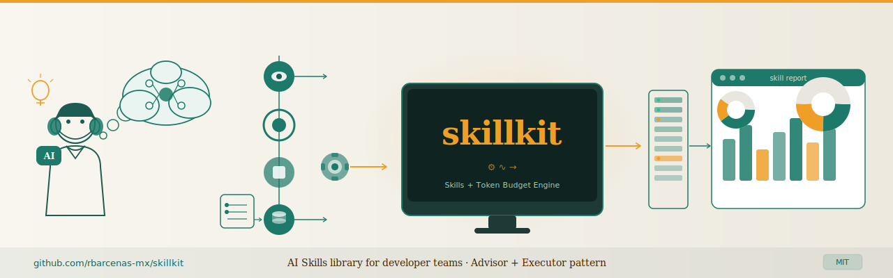

# SkillKit

> **Status: Beta** — the API and skill format are stabilizing but may change as we learn what works. PRs and feedback welcome.

<p align="center">
  
</p>

[](LICENSE)
[](https://github.com/rbarcenas-mx/skillkit/actions/workflows/ci.yml)

As an engineering manager, I'm always looking for ways to reduce repetitive work in my team so they can spend more time on what they do best: solving real engineering problems.

SkillKit is a collection of AI-powered engineering skills that aim to help development teams automate repetitive operational tasks, improve consistency across projects, and free up time for deep engineering work.

Every skill is designed around a simple insight: **use the right model for the right job**. A cheap local model can lint code, parse YAML, or check a checklist. An expensive remote model should only be invoked for critical path decisions. SkillKit's token budget engine makes this automatic.

The result is a toolkit that works with any AI agent -- opencode, Claude Code, Copilot, Cursor, or your own -- to bring structure and consistency to your team's engineering workflows without locking you into any platform or vendor.

## What is this?

SkillKit provides 10 ready-to-use development skills (CI, QA, audit, reviews, diagrams) built on the **Orchestrator + Executor** pattern, plus a **token budget engine** (`lib/`) that automatically selects the right model for the executor based on how much you want to spend. Every model in `lib/models.json` must be available and configured by you -- SkillKit selects the model, you provide the access.

| `TOKEN_BUDGET` | Executor model range | Token cost | Use case |
|---|---|---|---|
| `low` | Ollama local (gemma4, deepseek-coder, deepseek-r1) | $0 | Daily development |
| `medium` | Remote balanced (deepseek-v4-flash, kimi-k2.7) | $$ | Pre-push QA |
| `high` | Remote premium (glm-5.2, qwen3.7-max) | $$$ | Critical reviews |

## Architecture: Orchestrator + Executor

Every skill follows the **Orchestrator + Executor** pattern -- the strategy that Anthropic and other AI labs now recommend as the optimal way to manage token costs without sacrificing quality.

```
Remote Agent (Orchestrator)                    Local System (Executor)
   ┌──────────────────────┐                   ┌──────────────────────────┐
   │  Advisor model       │                   │  Worker model            │
   │  (Claude, GPT, etc.)  │                   │  (via TOKEN_BUDGET)      │
   │                      │                   │                          │
   │  • Decompose task     │  ── atomic ──→   │  • run.py call #1        │
   │  • Show progress bar  │     calls        │  • run.py call #2        │
   │  • Save checkpoints   │  ←── JSON ────   │  • run.py call #N        │
   │  • Present results    │                  │                          │
   │  • Token accounting   │                  │  Returns structured       │
   └──────────────────────┘                   │  result on stdout,       │
                                               │  progress on stderr      │
                                               └──────────────────────────┘
```

The **orchestrator** (the remote agent -- Claude Code, opencode, Copilot, etc.) is the "advisor" model. It reads `SKILL.md`, breaks the work into atomic one-shot calls to `run.py`, shows live progress to the user after each step, manages fault-tolerant checkpoints for resume, presents an initial execution plan and a final consolidated report, and tracks token consumption per phase.

The **executor** (`run.py`) is the "worker" -- resolved via `TOKEN_BUDGET` to the cheapest adequate model (local Ollama at $0, or a remote model at low/medium/high cost). It does one thing, returns one JSON on stdout, and exits. No orchestration logic in the executor.

This separation means:

- **You control the cost**: expensive reasoning stays in the orchestrator; the executor runs on the model you choose via `TOKEN_BUDGET`
- **Fault tolerance**: if an executor call fails, the orchestrator can retry, skip, or abort without losing progress -- checkpoints guarantee resume
- **Live feedback**: the orchestrator shows a progress bar and findings after every single executor call
- **Audit trail**: initial plan, each executor call result, and a final token report

## Model availability & graceful degradation

If the model mapped to your `TOKEN_BUDGET` level is **not available** (Ollama model not pulled, remote provider not configured, API key missing), SkillKit **never crashes**. Instead:

1. **Warns** you on stderr about the missing model
2. **Falls back** to the next available tier (e.g. `low` to `medium` to `high`)
3. If nothing works: **keeps your current model** and warns that TOKEN_BUDGET was bypassed
4. The skill continues execution regardless -- broken budget doesn't break your workflow

Example:

```
WARNING: TOKEN_BUDGET=low -> 'gemma4:26b' not found in Ollama
  Falling back to medium: deepseek-v4-flash
  Skill: ci.prepare -- proceeding with fallback model
```

## Prerequisites

The models referenced in `lib/models.json` for each `TOKEN_BUDGET` level must be made available by you. SkillKit selects the model -- you provide the access.

- **Local models** (`TOKEN_BUDGET=low`): pull with `ollama pull <model>` for each model listed in your chosen level
- **Remote models** (`TOKEN_BUDGET=medium/high`): the API key for each provider must be accessible to the curl calls made by run.py (typically via environment variables or an auth config file -- your agent's standard mechanism for providing secrets)
- If a model is not available, SkillKit **does not crash** -- it warns and falls back gracefully to the next available tier, or keeps your current model

## Quick start

```bash
pip install skillkit
```

Or from source:

```bash
git clone https://github.com/rbarcenas-mx/skillkit.git ~/skillkit
cd ~/skillkit
python3 configure.py   # interactive setup
```

`configure.py` detects your environment and walks you through:

1. **What agents** are installed (opencode, Claude, aider, Cursor)
2. **Ollama models** available locally
3. **Remote API keys** already set in your environment
4. **Token budget** — suggests `low` if Ollama is available, `medium`/`high` if remote keys found
5. **Model mapping** — lets you remap which Ollama model each skill uses
6. **Provider setup** — prompts for missing API keys (DeepSeek, opencode-go, Anthropic)

It then generates `~/.config/skillkit/config.json`, adds env vars to your shell rc, and symlinks skills/commands into detected agent directories.

After setup, source your shell and try a skill:

```bash
source ~/.bashrc
# then ask your agent: "Run ci.prepare for this project"
```

For manual setup (no install needed):

```bash
export SKILLKIT_HOME="$HOME/skillkit"
export TOKEN_BUDGET=low
```

## Skills

### spec-kit ecosystem

Designed to work with [spec-kit](https://github.com/github/spec-kit) artifacts (`specs/<feature>/spec.md`, `plan.md`, `tasks.md`).

| Skill | Description |
|---|---|
| `speckit.prespec` | Analyze a raw idea, detect ambiguities, generate pre-spec |
| `speckit.diagrams` | Generate Mermaid.js architecture diagrams from spec-kit artifacts |
| `speckit.audit` | Progressive audit of specs, plans, tasks, code |
| `speckit.audit-resolve` | Resolve audit findings with model per finding type |

### Git & CI/CD

Version control, integration planning, and deployment.

| Skill | Description |
|---|---|
| `ci.prepare` | Generate CI integration plan with atomic commits |
| `ci.execute` | Execute a ci/{id}_tasks.md plan with checkpoints and rollback |
| `ci.ship` | Validate, push, and monitor CI for commits |
| `pr-review-expert` | Structured PR review (blast radius, security, breaking changes) |

### QA & Testing

Validation plans and execution for infrastructure, unit tests, flows, stress, and scale.

| Skill | Description |
|---|---|
| `qa.prepare` | Generate QA validation plans by type (infra, unit, flow, stress, scale) |
| `qa.execute` | Execute QA plans -- Docker, migrations, tests, HTTP flows |

## Token Budget Engine

Every skill calls `resolve_model(skill_name)` which:

1. Reads `TOKEN_BUDGET` (`low` | `medium` | `high`)
2. Looks up the skill in `lib/models.json` into `skill_mapping`
3. Returns the right model for that budget level
4. Sets `SKILLKIT_MODEL`, `SKILLKIT_PROVIDER`, `SKILLKIT_API_URL`, `SKILLKIT_API_KEY` automatically
5. **If unavailable**: degrades gracefully -- warns, falls back, never crashes

Configure your own mapping by editing `lib/models.json`. Add or remove providers and models as needed -- the engine is provider-agnostic.

### Provider configuration

Remote provider URLs and API keys are configured in `lib/models.json` (`providers`) and can be overridden per-user in `~/.config/skillkit/config.json`.

SkillKit reads keys from environment variables by default. The stock `lib/models.json` expects:

| Provider | Env var |
|---|---|
| `deepseek` | `DEEPSEEK_API_KEY` |
| `opencode-go` | `OPENCODE_API_KEY` |
| `anthropic` | `ANTHROPIC_API_KEY` |

Example `.bashrc`:

```bash
export DEEPSEEK_API_KEY="sk-..."
export OPENCODE_API_KEY="sk-..."
export ANTHROPIC_API_KEY="sk-ant-..."
```

Or use a per-user config file (`~/.config/skillkit/config.json`):

```json
{
  "providers": {
    "deepseek": {
      "api_key": "sk-..."
    },
    "opencode-go": {
      "api_key": "sk-..."
    }
  }
}
```

Set `SKILLKIT_CONFIG_FILE` to use a different config path.

### Adding a new provider (V1.0)

SkillKit V1.0 supports **OpenAI-compatible** providers only. Add the provider to `lib/models.json` → `providers`, then reference it from a model:

```json
{
  "providers": {
    "openrouter": {
      "base_url": "https://openrouter.ai/api/v1",
      "api_key": "{env:OPENROUTER_API_KEY}"
    }
  },
  "models": [
    {
      "id": "openrouter/anthropic/claude-sonnet-4",
      "provider": "openrouter",
      "api_model": "anthropic/claude-sonnet-4",
      "description": "Claude Sonnet 4 via OpenRouter",
      "speed": "medium",
      "token_cost": "medium"
    }
  ]
}
```

The environment variable name is up to you — just match it in `{env:YOUR_NAME}`. Then assign the model ID to any skill in `skill_mapping`.

**Note:** the stock `run.py` executors use the OpenAI chat-completions format (`/chat/completions`, `Authorization: Bearer`, `choices[0].message.content`). Providers that are not OpenAI-compatible need a custom driver in the skill or an OpenAI-compatible proxy.

For non-OpenAI providers (e.g. Anthropic, Gemini), run a local OpenAI-compatible proxy such as [LiteLLM Proxy](https://docs.litellm.ai/docs/simple_proxy) and point SkillKit at it.

### Security notes

- API keys are **never printed** by the engine or the skills.
- Keys are passed to `curl` via a temporary config file (`-K /tmp/skillkit/skillkit_headers.conf`), never as command-line arguments, so they do not appear in `ps`.
- If you store keys in `~/.config/skillkit/config.json`, restrict its permissions: `chmod 600 ~/.config/skillkit/config.json`.
- The temporary header file is overwritten on each run but is not automatically deleted. On shared machines, consider adding `rm /tmp/skillkit/skillkit_headers.conf` after the skill finishes, or use an in-memory secret manager.

### Configurable fallback

If the model for the requested `TOKEN_BUDGET` is unavailable, the engine follows the `fallback_chain` defined in `lib/models.json` (`config.fallback_chain`). The user controls the order; opencode-go is just one provider among many, not a hardcoded default.

## Directory structure

```
skillkit/
  lib/                    # Token budget engine
    __init__.py           resolve_model(), budget resolution, graceful fallback
    models.json           Model catalog + per-skill mapping
  skills/                 Skill implementations (Anthropic-format)
    ci.execute/
      SKILL.md            Orchestrator instructions
      run.py              Executor script
    ...
  tests/                  Test suite
    test_lib.py           Unit tests for token budget engine
  commands/               CLI command references (opencode)
  configure.py            Interactive setup script
  pyproject.toml          Package metadata + dev dependencies
  TODO.md                 Public roadmap
```

## Development

```bash
pip install -e ".[dev]"   # editable install + dev deps
pytest -v                  # run tests
ruff check .              # lint
```

Contributions welcome — see [CONTRIBUTING.md](CONTRIBUTING.md) and [TODO.md](TODO.md).

## Requirements

- Python 3.10+
- [Ollama](https://ollama.ai) (for `TOKEN_BUDGET=low`)
- `gh` CLI (for PR review and ci.ship)
- `curl` (for remote model calls)

## Roadmap

See [TODO.md](TODO.md) for the current priorities: tests, CI, PyPI publishing, model catalog balance, and a standalone CLI.

## How to extend SkillKit with new skills

A skill is a directory under `skills/<name>/` with three parts: an entry in `lib/models.json` (maps the skill to models per TOKEN_BUDGET level), a `run.py` executor (Python, one atomic task, returns JSON), and a `SKILL.md` orchestrator (Anthropic-format instructions with standard headers, execution plan, and token report).

To create one, just tell your AI:

```
Read $SKILLKIT_HOME/CONTRIBUTING.md and create a new skill called <name> that does <purpose>
```

All the patterns -- resolve_model, spinner, checkpoint, -K for API keys, JSON output, report templates -- are documented in detail there. See [CONTRIBUTING.md](CONTRIBUTING.md) for the full guide.

## Credits & Attribution

This project builds upon and adapts open-source skills from the AI coding community. Some skills are original; others are derived from community work.

- **`pr-review-expert`** -- derived from a community PR review skill. Original author unknown. If you recognize this as your work, please [open an issue](https://github.com/rbarcenas-mx/skillkit/issues) for proper attribution.
- **`speckit.audit` / `speckit.diagrams` / `speckit.prespec`** -- adapted from spec-kit patterns.
- **`ci.execute` / `ci.prepare` / `ci.ship` / `qa.execute` / `qa.prepare`** -- original implementations.

See [CREDITS.md](CREDITS.md) for detailed attributions.

## License

MIT -- see [LICENSE](LICENSE) for full text.
